# 🎓 YouTube AI Tutor — Your Smart Study Buddy for YouTube
> Turn any YouTube video into your personal AI-powered tutor. Ask questions, annotate frames, take notes, and export everything in one place—100% Free & Private.

---

## 🌟 Overview

**YouTube AI Tutor** is a powerful Chrome extension designed to supercharge your learning on YouTube. Tired of pausing tutorials, switching tabs, and losing your train of thought? The extension integrates a native Chrome side panel where an AI assistant analyzes video frames, transcriptions, and your own hand-drawn annotations to answer your questions in real time.

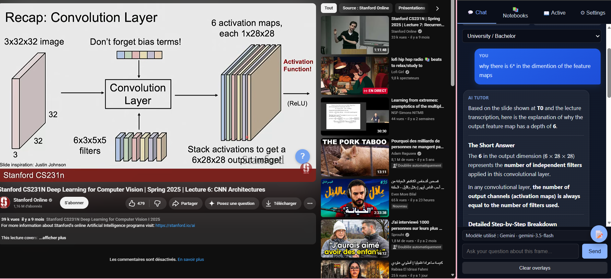

---

## 🚀 Key Features

### 🎥 1. Multi-Frame Smart Capture
Capture a temporal sequence of frames (`T-X`, `T0`, `T+X`) rather than just a single freeze-frame. This allows the AI to understand motion, code changes, and dynamic diagrams.
* **Interval Adjustments:** Set your preferred time-window between frames.
* **Canvas Annotations:** Draw lines, arrows, circles, and write text directly on the video frame.
* **Burn-in Merging:** Your drawings are merged directly into the image sent to the AI.

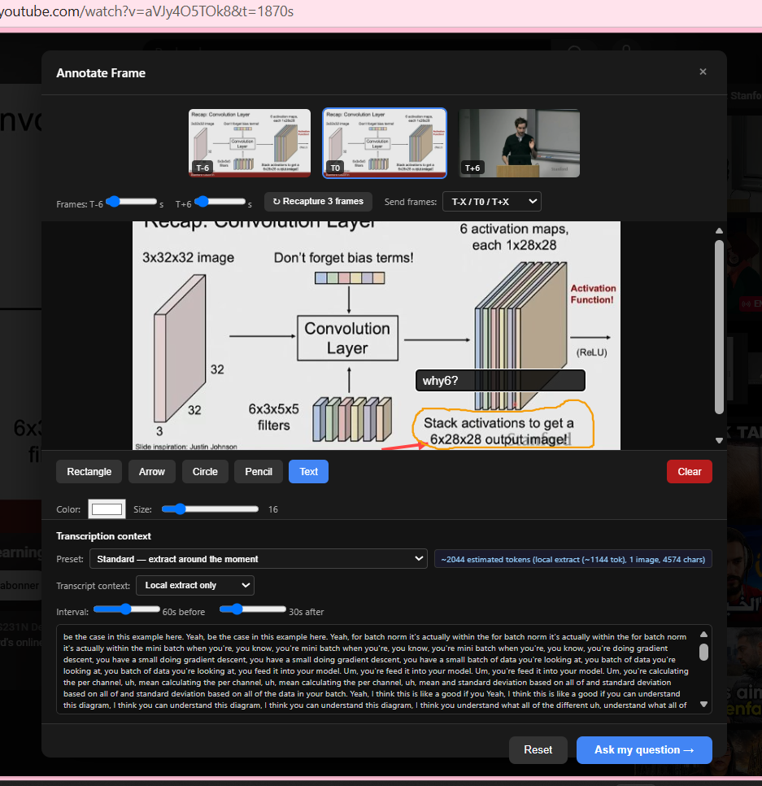

### 💻 2. Native Chrome Side Panel
Study side-by-side with your video. The extension uses Chrome's native Side Panel API so it never overlays or interrupts the video player.
* **Live transcription preview:** See the exact text context.
* **One-click synchronization:** Instantly recapture frames at the current timestamp.
* **Educational Levels:** Adjust the response style from *ELI5 (Explain Like I'm 5)* to *Expert*.

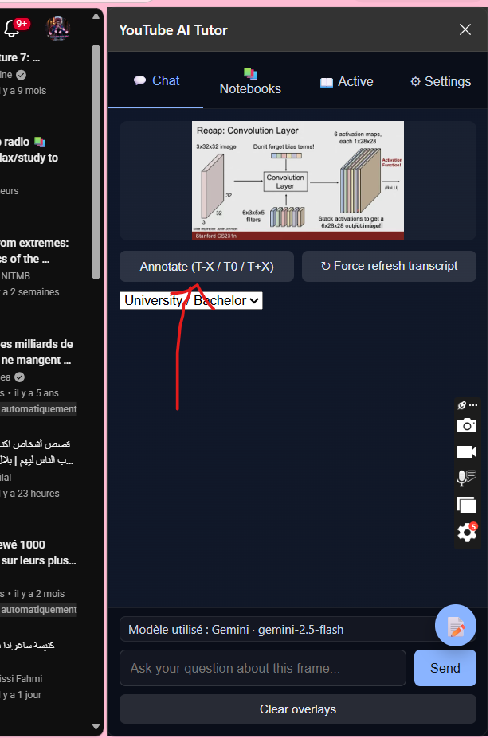

### 🤖 3. Context-Aware AI Responses
The AI receives three critical layers of context: the **video frames**, the **transcription text**, and your **visual annotations**.
* **Precise explanations:** The AI knows exactly what you are pointing to.
* **LaTeX formatting:** Formulas, math, and scientific notations are rendered beautifully.

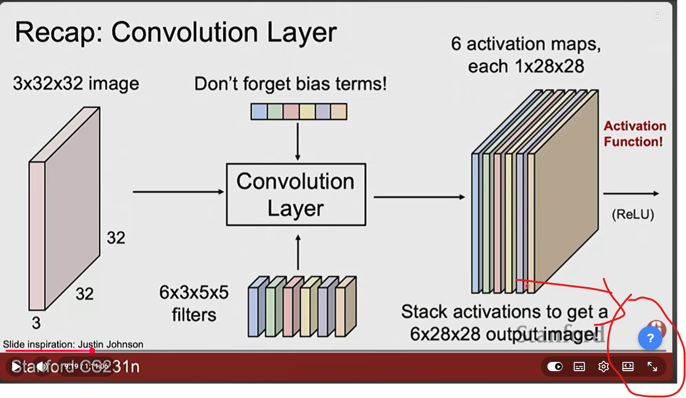

### 📔 4. Multi-Notebook Organization
Save your knowledge and organize it by course, subject, or project.
* **Color-Coded Notebooks:** Easily differentiate topics.
* **Dual Entries:** Keep track of both AI chat history and your personal markdown notes.
* **Local Persistence:** Data is securely saved using IndexedDB directly in your browser.

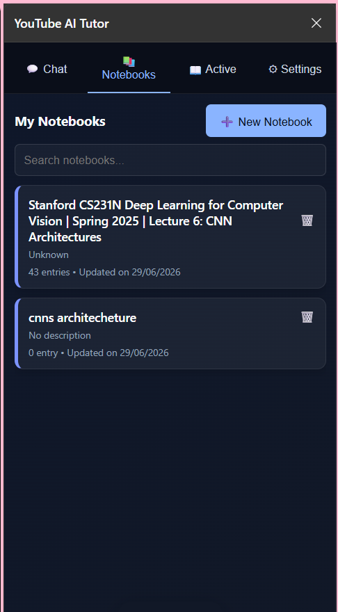

### 📥 5. Universal Exports
Take your learning logs wherever you go.
* Export your entire notebook as **Markdown** (compatible with Obsidian, Notion, GitHub), **PDF** (styled with syntax-highlighted code), **HTML**, or **JSON**.

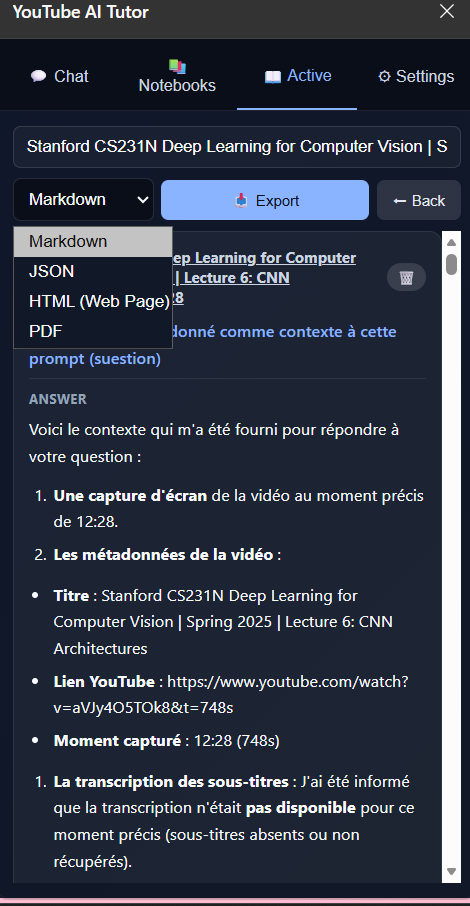

---

## ⚡ Setup & Installation

> [!NOTE]
> Since this extension is not yet published on the official extension stores (Chrome Web Store / Edge Add-ons) yet, you can easily install it manually in Chrome or Edge in just a few clicks.

### 📥 Step 1: Download & Extract
1. Download the extension ZIP file from **[Google Drive](https://drive.google.com/file/d/1Jr_JCSRAtfsdO3WoFPQoUgeTaoad5Xan/view?usp=drive_link)**.
2. **Extract** (unzip) the file somewhere on your computer (e.g., your Desktop).

### 🧩 Step 2: Open Extensions Menu
1. Click the **Extensions icon** (puzzle piece 🧩) right next to your browser's search bar.
2. Click **Manage extensions** (*Gérer les extensions*).

| 1. Click Extensions Icon | 2. Click Manage Extensions |
| --- | --- |
| 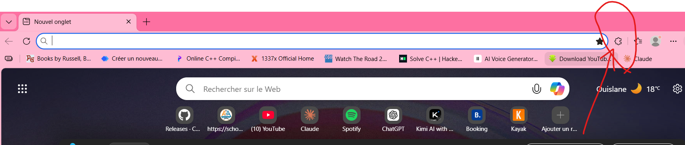 | 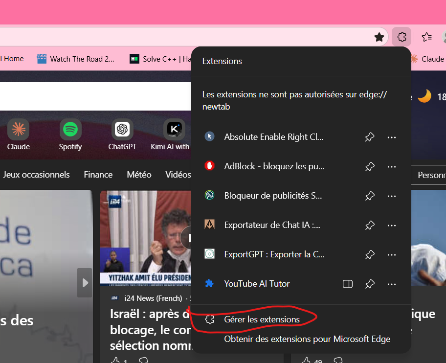 |

### ⚙️ Step 3: Enable Developer Mode
1. Toggle the **Developer mode** switch in the top-right corner to **ON** (*Activer le mode développeur*).

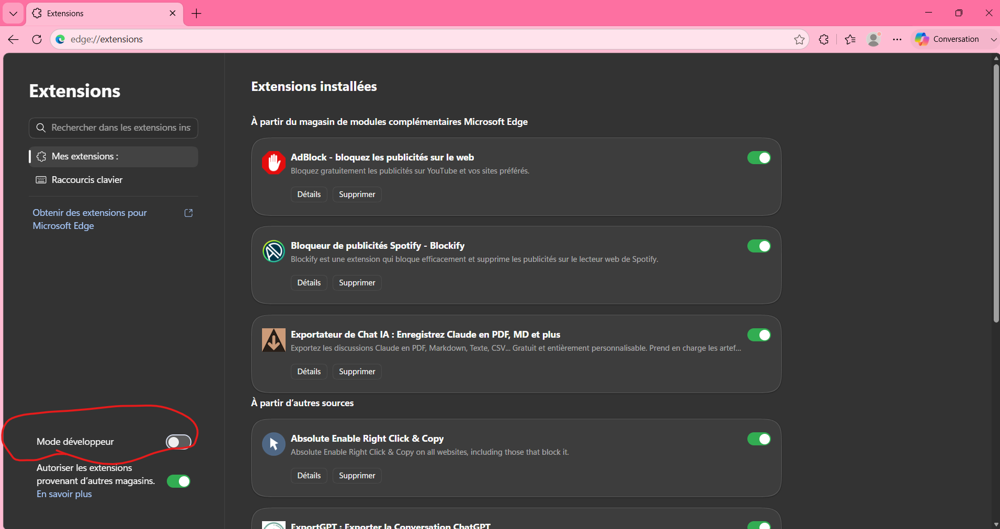

### 📁 Step 4: Load the Unpacked Extension
1. Click **Load unpacked** (*Charger l'extension décompressée*) in the top-left corner.
2. Select the extracted `youtube-ai-tutor` folder.

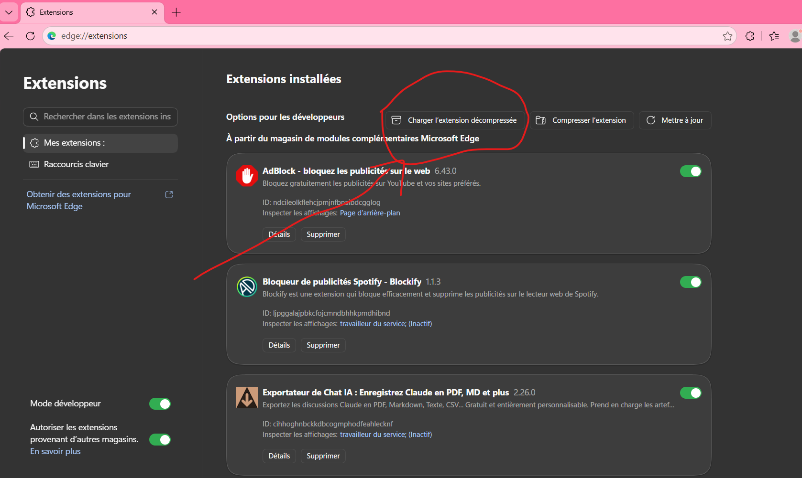

🎉 **Done!** The extension is now installed. Pin it to your browser toolbar so you can open it at any time while watching YouTube.

---

## 🔑 AI Providers & Keys
No middleman, no subscription, no hidden markups. You use your own API keys directly.

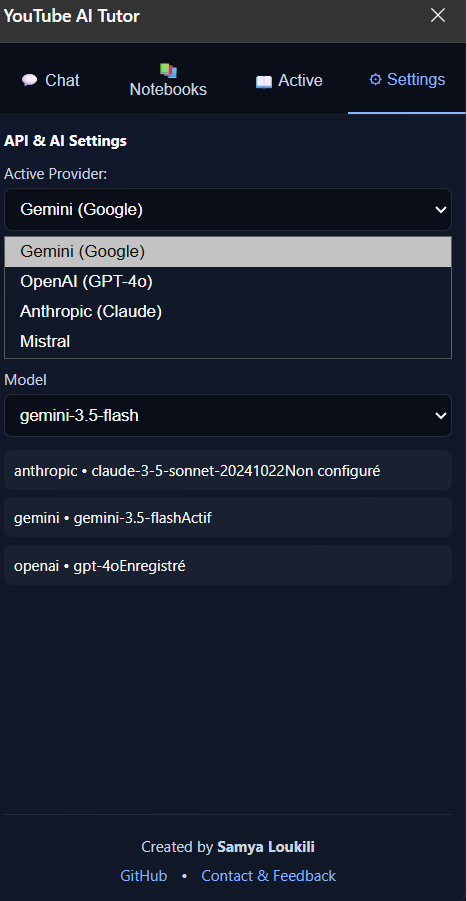

* **Google Gemini:** (Recommended) Generous **free tier** available!
  1. Go to [Google AI Studio](https://aistudio.google.com/).
  2. Click **Get API Key** and generate your key.
  3. Paste it into the extension's settings.
* **Other Supported Providers:** OpenAI (GPT-4o), Anthropic (Claude), Mistral AI, and OpenRouter (for 100+ models).

---

## 🔒 Privacy First
* **Zero Server Overhead:** The extension communicates directly from your browser to the AI provider. There are no intermediary backend servers.
* **100% Local Storage:** Your API keys, notes, history, and images are stored in your browser's IndexedDB.
* **Zero Tracking:** No telemetry, no cookies, no analytics.

---

## 💬 A Message from the Creator
> "I built this extension because I was tired of pausing YouTube lectures, switching tabs, and losing my train of thought. YouTube AI Tutor is completely free, your API keys stay in your browser, and I literally can't see anything you do. If you find it useful, send me some nice words! 💖"
>
> — **Samya Loukili** 📧 [samyaloukili2@gmail.com](mailto:samyaloukili2@gmail.com)

---
*For a complete web introduction, visit the official page: **[kcbluojkxicfs.kimi.page](https://kcbluojkxicfs.kimi.page/)***
